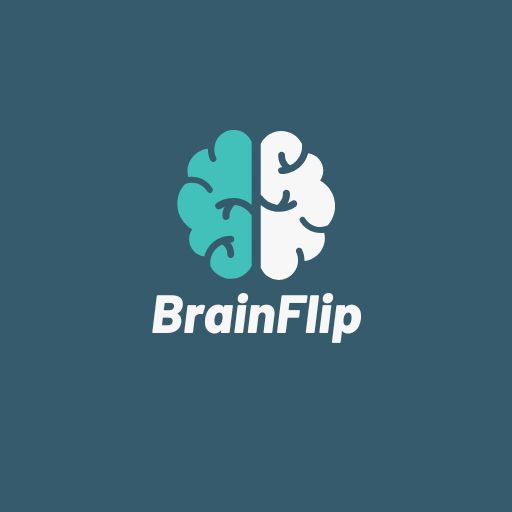
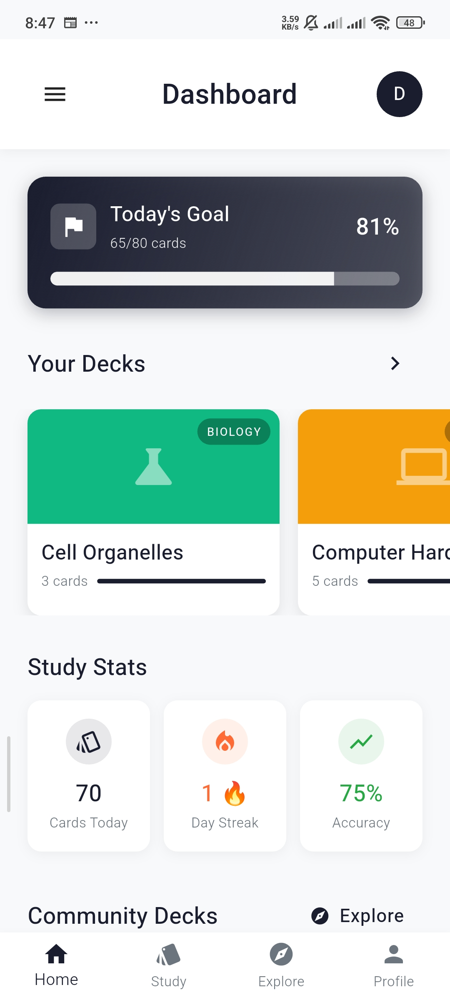
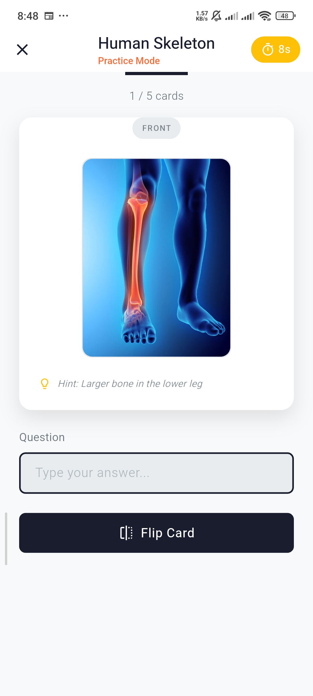
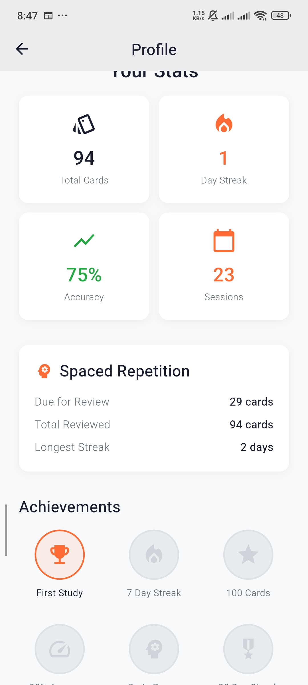
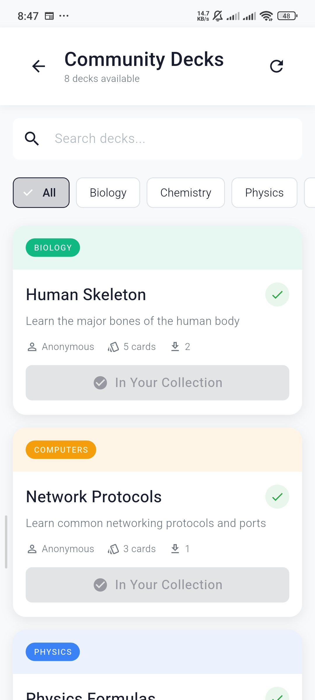

# 📱 BrainFlip v1.0.0

  

  <h3><strong>Master STEM subjects with smart spaced repetition flashcards</strong></h3>

  
  
  

---

## 🎯 What is BrainFlip?

BrainFlip is a powerful flashcard learning app that uses **spaced repetition** - a proven technique that helps you remember information longer. Perfect for students studying biology, chemistry, physics, computer science, and more!

---

## ✨ Features

- 🧠 **Smart Spaced Repetition** - Cards appear at optimal intervals for maximum retention
- ⚡ **Timed Study Sessions** - Build focus with countdown timers
- 🏆 **Gamification** - Earn badges, maintain streaks, complete daily goals
- 👥 **Community Decks** - Discover and share flashcard decks
- 🎨 **Custom Deck Creation** - Create your own flashcard decks
- 📊 **Progress Tracking** - Monitor your learning journey
- 📱 **Offline Mode** - Study anywhere, anytime
- 🎯 **Multiple Subjects** - Pre-built decks for STEM subjects

---

## 📥 Installation

### **For Android (Recommended)**

1. **Download the APK**
   - Click the download button above or download `brainflip-v1.0.0.apk`

2. **Enable Installation from Unknown Sources**
   - Go to `Settings` → `Security` → Enable `Unknown Sources`
   - Or `Settings` → `Apps` → `Special Access` → `Install Unknown Apps` → Allow for your browser/file manager

3. **Install the APK**
   - Open the downloaded APK file
   - Tap `Install`
   - Wait for installation to complete

4. **Launch BrainFlip**
   - Open the app from your app drawer
   - Sign up or log in
   - Start learning! 🎉

---

## 📱 System Requirements

- **OS:** Android 7.0 (API 24) or higher
- **Storage:** 50 MB free space
- **RAM:** 1 GB minimum (2 GB recommended)
- **Internet:** Required for sync (offline study support coming soon)

---

## 📸 Screenshots

  
  
  
  

---

## 🚀 Quick Start Guide

1. **Sign Up** - Create an account or use Google Sign-In
2. **Choose Decks** - Select 2-3 decks to get started
3. **Start Studying** - Tap a deck and begin your first session
4. **Track Progress** - Watch your streak grow and earn badges!
5. **Create Custom Decks** - Make your own flashcards
6. **Share & Discover** - Explore community decks

---

## 🎓 Study Tips

- **Study Daily** - Even 10 minutes helps maintain your streak
- **Trust the Algorithm** - Let spaced repetition work its magic
- **Create Custom Decks** - Make flashcards for your specific needs
- **Use Hints Wisely** - They're there to help, not hinder
- **Set Daily Goals** - Start with 20 cards per day

---

## 🐛 Known Issues

- Image upload not yet supported (coming soon!)
- iOS version in development

---

## 📝 Changelog

### Version 1.0.0 (2024-XX-XX)

**Initial Release**

- ✅ Spaced repetition algorithm (SM-2)
- ✅ User authentication (Email & Google)
- ✅ Pre-built STEM decks
- ✅ Custom deck creation
- ✅ Community deck sharing
- ✅ Gamification system
- ✅ Progress tracking
- ✅ Timed study mode
- ✅ Offline support

---

## 🆘 Support & Feedback

- **Bug Reports:** [Open an issue](https://github.com/kabakadev/brainflip_mobile_app/issues)
- **Feature Requests:** [Discussions](https://github.com/kabakadev/brainflip_mobile_app/discussions)
- **Email:** support@brainflip.app (coming soon)

---

## 🤝 Contributing

BrainFlip is currently in active development. Contributions are welcome!

1. Fork the repository
2. Create a feature branch
3. Submit a pull request

---

## 📄 License

This project is licensed under the MIT License - see the [LICENSE](LICENSE) file for details.

---

## 🙏 Acknowledgments

- Built with [Flutter](https://flutter.dev/)
- Backend powered by [Firebase](https://firebase.google.com/)
- Spaced repetition based on SuperMemo SM-2 algorithm
- Icons from [Lucide](https://lucide.dev/)

---

## 🌟 Star Us!

If you find BrainFlip helpful, please ⭐ star this repository!

---

  Made with ❤️ by [Your Name]
  
  **Study Smarter. Remember Longer. 🧠**

